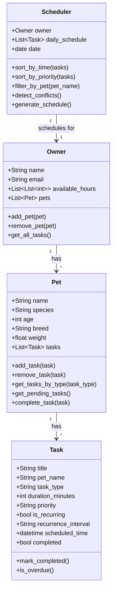

```mermaid
classDiagram
    class Task {
        +String title
        +String pet_name
        +String task_type
        +int duration_minutes
        +String priority
        +bool is_recurring
        +String recurrence_interval
        +datetime scheduled_time
        +bool completed
        +mark_completed()
        +is_overdue()
    }

    class Pet {
        +String name
        +String species
        +int age
        +String breed
        +float weight
        +List~Task~ tasks
        +add_task(task)
        +remove_task(task)
        +get_tasks_by_type(task_type)
        +get_pending_tasks()
        +complete_task(task)
    }

    class Owner {
        +String name
        +String email
        +List~List~int~~ available_hours
        +List~Pet~ pets
        +add_pet(pet)
        +remove_pet(pet)
        +get_all_tasks()
    }

    class Scheduler {
        +Owner owner
        +List~Task~ daily_schedule
        +date date
        +sort_by_time(tasks)
        +sort_by_priority(tasks)
        +filter_by_pet(pet_name)
        +detect_conflicts()
        +generate_schedule()
    }

    Owner "1" --> "*" Pet : has
    Pet "1" --> "*" Task : has
    Scheduler "1" --> "1" Owner : schedules for
```
